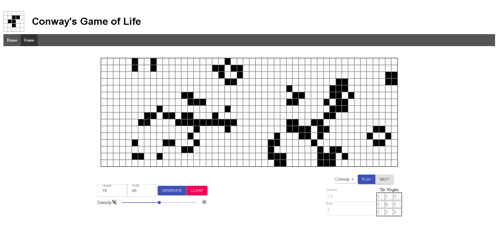

# Conway's Game of Life

****

**Many of the following details have been taken directly from the Wikipedia for Conway's Game of Life.

## Summary
The Game of Life, also known simply as Life, is a cellular automaton devised by the British mathematician John Horton Conway in 1970. 
It is a zero-player game, meaning that its evolution is determined by its initial state, requiring no further input. 
One interacts with the Game of Life by creating an initial configuration and observing how it evolves. 
It is Turing complete and can simulate a universal constructor or any other Turing machine.

Simply run the application by installing the dependencies with `npm i`, and then by running `npm start`.

The application will allow you to generate a grid of custom proportions with a varied, randomized
density of populated grid cells. Then, you'll be able to select a ruleset from the dropdown,
and run the simulation through each iteration of that ruleset, as well as swap rulesets on the fly,
pause the simulation, and interact directly with the grid.

## Rules for Conways Game of Life

The universe of the Game of Life is an infinite, two-dimensional orthogonal grid of square cells, each of which is in one of two possible states, live or dead, (or populated and unpopulated, respectively). 
Every cell interacts with its eight neighbours, which are the cells that are horizontally, vertically, or diagonally adjacent. 
At each step in time, the following transitions occur:

- Any live cell with fewer than two live neighbours dies, as if by underpopulation.
- Any live cell with two or three live neighbours lives on to the next generation.
- Any live cell with more than three live neighbours dies, as if by overpopulation.
- Any dead cell with exactly three live neighbours becomes a live cell, as if by reproduction.

These rules, which compare the behavior of the automaton to real life, can be condensed into the following:

- Any live cell with two or three live neighbours survives.
- Any dead cell with three live neighbours becomes a live cell.
- All other live cells die in the next generation. Similarly, all other dead cells stay dead.

The initial pattern constitutes the seed of the system. 
The first generation is created by applying the above rules simultaneously to every cell in the seed, live or dead; births and deaths occur simultaneously, and the discrete moment at which this happens is sometimes called a tick. 
Each generation is a pure function of the preceding one. 
The rules continue to be applied repeatedly to create further generations.

## Variations on the Rules

Different threshold values for how many neighbors it takes to either survive or for a cell to die can result
in wildly different patterns. A number of preset patterns have been included with this application to experiment with.

## Roadmap

- More Robust Test Suite
- Plain English Rule Evaluations (Modal)
- Rule Customization
- Rule Import/Export
- Grid Import/Export
- Preset Grid Pattern Loading
- Rule/Pattern Preset Descriptions
